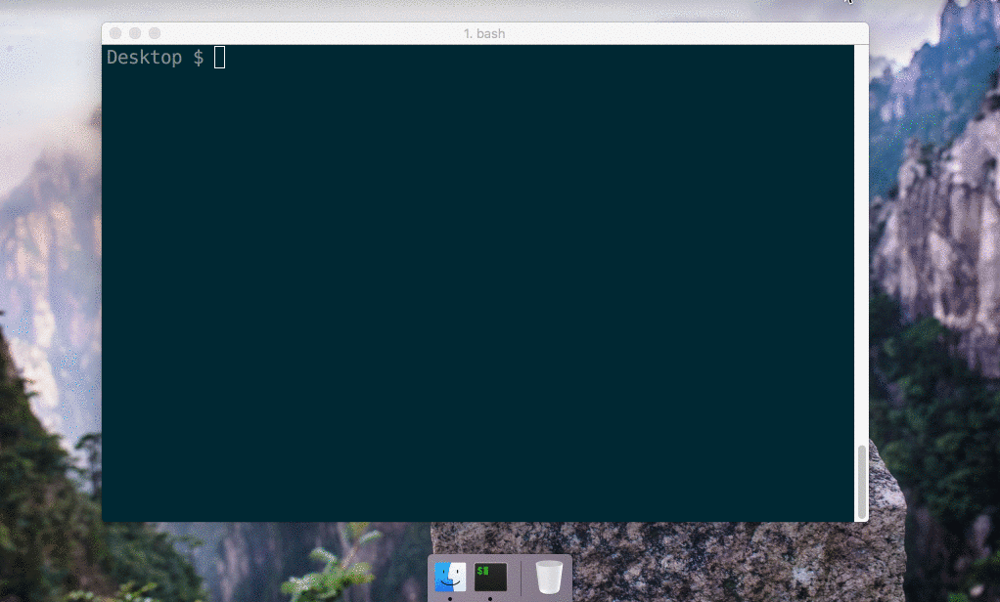

# Nativefier

[](https://travis-ci.org/jiahaog/nativefier)
[](https://codeclimate.com/github/jiahaog/nativefier)
[](https://www.npmjs.com/package/nativefier)
[](https://david-dm.org/jiahaog/nativefier)


You want to make a native wrapper for WhatsApp Web (or any web page).

```bash
nativefier web.whatsapp.com
```



You're done.

## Table of Contents

  - [Installation](#installation)
  - [Usage](#usage)
  - [Optional Dependencies](#optional-dependencies)
  - [How It Works](#how-it-works)
  - [API Documentation](docs/api.md)
  - [Changelog](docs/changelog.md)
  - [Development](docs/development.md)
  - [License](#license)

## Introduction

Nativefier is a command line tool that allows you to easily create a desktop application for any web site with succinct and minimal configuration. Apps are wrapped by [Electron](http://electron.atom.io) in an OS executable (`.app`, `.exe`, etc.) for use on Windows, macOS and Linux.

I did this because I was tired of having to `⌘-tab` or `alt-tab` to my browser and then search through the numerous open tabs when I was using [Facebook Messenger](http://messenger.com) or [Whatsapp Web](http://web.whatsapp.com).

View the changelog [here](https://github.com/jiahaog/nativefier/blob/development/docs/changelog.md).

[Relevant Hacker News Thread](https://news.ycombinator.com/item?id=10930718)

### Features

- Automatically retrieves the correct icon and app name
- Flash Support (with [`--flash`](docs/api.md#flash) flag)
- Javascript and CSS injection

## Installation

### Requirements
- macOS 10.9+ / Windows / Linux
- [Node.js](https://nodejs.org/) `>=4`

```bash
npm install nativefier -g
```

See [optional dependencies](#optional-dependencies) for more.

## Usage

Creating a native desktop app for [medium.com](http://medium.com):

```bash
nativefier "http://medium.com"
```

Nativefier will intelligently attempt to determine the app name, your OS and processor architecture, among other options. If desired, the app name or other options can be overwritten by specifying the `--name "Medium"` as part of the command line options, as such.

```bash
nativefier --name "Some Awesome App" "http://medium.com"
```
Read the [API documentation](docs/api.md) for other command line flags and options that can be used to configure the packaged app.

If you would like high resolution icons to be used, please contribute to the [icon repository](https://github.com/jiahaog/nativefier-icons)!

**For Windows Users:** Take note that the application menu is automatically hidden by default, you can press `alt` on your keyboard to access it.

**For Linux Users:** Do not put spaces if you define the app name yourself with `--name`, as this will cause problems (tested on Ubuntu 14.04) when pinning a packaged app to the launcher.

## Optional Dependencies

### Icons for Windows Apps from non-Windows platforms

You need [Wine](https://www.winehq.org/) installed, make sure that `wine` is in your `$PATH`.

### Icon Conversion for macOS

To support conversion of a `.png` or `.ico` into a `.icns` for a packaged macOS app icon (currently only supported on macOS), you need the following dependencies.

#### [iconutil](https://developer.apple.com/library/mac/documentation/GraphicsAnimation/Conceptual/HighResolutionOSX/Optimizing/Optimizing.html)

You need [Xcode](https://developer.apple.com/xcode/) installed.

#### [imagemagick](http://www.imagemagick.org/script/index.php)

Make sure `convert` and `identify` are in your `$PATH`.

### Flash

#### [Google Chrome](https://www.google.com/chrome/)

Google Chrome is required for flash to be supported. Alternatively, you could download the PepperFlash Chrome plugin and specify the path to it directly with the `--flash` flag. See the command line options below for more details.

## How It Works

A template app with the appropriate event listeners and callbacks set up is included in the `./app` folder. When the `nativefier` command is executed, this folder is copied to a temporary directory with the appropriate parameters in a configuration file, and is packaged into an app with [Electron Packager](https://github.com/electron-userland/electron-packager).

In addition, I built [GitCloud](https://github.com/jiahaog/gitcloud) to use GitHub as an icon index, and also the [pageIcon](https://github.com/jiahaog/page-icon) fallback to infer a relevant icon from a url.

## API Documentation

See [API](docs/api.md).

## Changelog

See [Changelog](docs/changelog.md).

## Development

See [Development](docs/development.md).

## Docker Image

The [Dockerfile](Dockerfile) is designed that you can use it like the "normal" nativefier app. By default the command `nativefier --version` will be executed. Before you can use the Image you have to build it like follow:

    docker build -t local/nativefier .
 
After that you can build your first nativefier app to the local `$TARGET-PATH`. Please ensure that you have write access to the `$TARGET-PATH`:

    docker run -v $TARGET-PATH:/target local/nativefier https://my-web-app.com/ /target/
    
You can also use additional source or nativefier options like e.g. use a icon:

    docker run -v $PATH_TO_ICON/:/src -v $TARGET-PATH:/target local/nativefier --icon /src/icon.png --name whatsApp -p linux -a x64 https://my-web-app.com/ /target/

## License

[MIT](LICENSE.md)
