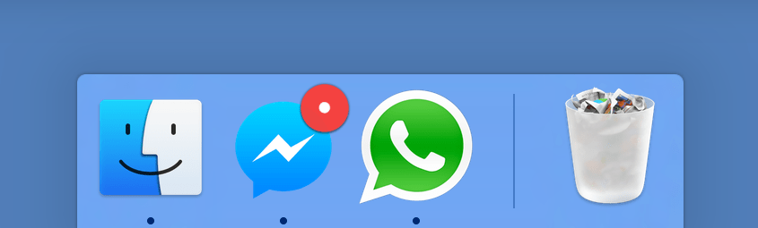

# Nativefier

👋 dear users / contributors! Public service announcement!

Nativefier is maintained by YOU. It's reasonably sane to hack on nowadays,
it fits the use cases needed by the original author and the current maintainer,
so _we_ are not doing any active development.

But it's alive! It at least follows Electron releases with maintenance patches,
and if YOU use it and want to see juicy features & fixes, PR welcome!
Help welcome in particular on our [pinned issues](https://github.com/nativefier/nativefier/issues),
or any issue / feature that motivates you 🙂.

Thanks! Take care.

---

[](https://github.com/nativefier/nativefier/actions?query=workflow%3Aci)
[](https://www.npmjs.com/package/nativefier)



You want to make a native wrapper for WhatsApp Web (or any web page).

```bash
nativefier web.whatsapp.com
```


You're done.

## Introduction

Nativefier is a command-line tool to easily create a desktop app for any web site
with minimal configuration. Apps are wrapped by [Electron](https://www.electronjs.org/)
(which uses Chromium under the hood) in an OS executable (`.app`, `.exe`, etc)
for use on Windows, macOS and Linux.

I did this because I was tired of having to `⌘-tab` or `alt-tab` to my browser and then search
through the numerous open tabs when I was using [Facebook Messenger](https://messenger.com) or
[Whatsapp Web](https://web.whatsapp.com) ([HN thread](https://news.ycombinator.com/item?id=10930718)). Nativefier features:

- Automatically retrieval of app icon / name.
- JavaScript and CSS injection.
- Many more, see the [API docs](docs/api.md) or `nativefier --help`

## Installation

- macOS 10.9+ / Windows / Linux
- [Node.js](https://nodejs.org/) `>= 10` and npm `>= 6`
- Optional dependencies:
    - [ImageMagick](http://www.imagemagick.org/) or [GraphicsMagick](http://www.graphicsmagick.org/) to convert icons.
      Make sure `convert` and `identify` or `gm` are in your system `$PATH`.
    - [Wine](https://www.winehq.org/) to package Windows apps under non-Windows platforms.
      Make sure `wine` is in your system `$PATH`.

Then, install Nativefier globally with  `npm install -g nativefier`

## Usage

To create a native desktop app for [medium.com](https://medium.com),
simply  `nativefier "medium.com"`

Nativefier will try to determine the app name, and well as lots of other options.
If desired, these options can be overwritten. For example, to override the name,
`nativefier --name 'My Medium App' 'medium.com'`

**Read the [API documentation](docs/api.md) or run `nativefier --help`**
to learn about other command-line flags usable to configure the packaged app.

To have high-resolution icons used by default for an app/domain, please
contribute to the [icon repository](https://github.com/nativefier/nativefier-icons)!

## Usage with Docker

Nativefier is also usable from Docker.
- Pull the latest stable image from Docker Hub: `docker pull nativefier/nativefier`
- ... or build the image yourself: `docker build -t local/nativefier .`
  (in this case, replace `nativefier/` in the below examples with `local/`)

By default, the command `nativefier --help` will be executed.
To build e.g. a Gmail nativefier app to a writable local `~/nativefier-apps`,

```bash
docker run --rm -v ~/nativefier-apps:/target/ nativefier/nativefier https://mail.google.com/ /target/
```

You can pass Nativefier flags, and mount volumes to provide local files. For example, to use an icon,

```bash
docker run --rm -v ~/my-icons-folder/:/src -v $TARGET-PATH:/target nativefier/nativefier --icon /src/icon.png --name whatsApp -p linux -a x64 https://web.whatsapp.com/ /target/
```

## Development

Help welcome on [bugs](https://github.com/nativefier/nativefier/issues?q=is%3Aopen+is%3Aissue+label%3Abug) and
[feature requests](https://github.com/nativefier/nativefier/issues?q=is%3Aopen+is%3Aissue+label%3Afeature-request).

[Developer / build docs](docs/development.md), [API documentation](docs/api.md), 
[Changelog](CHANGELOG.md).

## License

[MIT](LICENSE.md)
